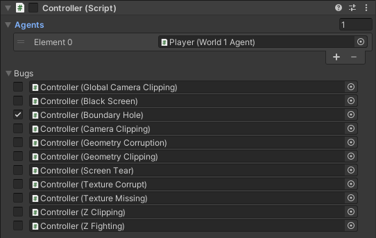
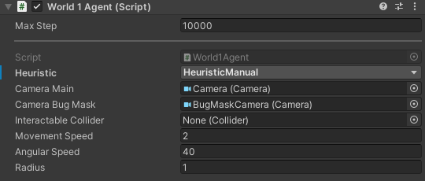

# Live Configuration

`worldofbugs` environment supports live configuration. Bugs can be configured at runtime via a simple Python API, outlined below.

## Configuring Bugs

A bug can be enabled using the `enable_bug` method, for example:

```
env.enable_bug("TextureMissing")
```

A bug can be disabled using the `disable_bug` method, for example:

```
env.disable_bug("TextureMissing")
```

Bug names a derived from their type name as it appears in Unity. A full list of bugs can be found [here](../../BugZoo.md). It is up to the environment which bugs it implements, so not all environments will implement all bugs. To see a list of all the bugs that an environment implements try `env.enable_bug("info")`. For the moment an error is raised which lists all available bugs.

If the Unity editor is open, a list of all bugs can also be found in the `Controller` game object for most environments, they can be enabled/disabled by clicking the associated tick boxes.




## Configuring Agent Behaviour

An agent's behaviour can be changed using the `set_agent_behaviour` method, for example:

```python
env.set_agent_behaviour('Python')
```

Setting the behaviour to `'Python'` will enable the current Python policy, the agent will take actions received via `env.step`. Otherwise, a heuristic behaviour defined in Unity will be used, and any Python actions will be ignored. The actual action taken can be retrieved by inspecting `info` returned by `env.step` as follows:

```python
    state, reward, done, info = env.step(0)
    info['Action']
```

Again, it is up to the environment (and in particular the agent) to define which heuristic behaviours are available.

If the Unity editor is open, an agent's behaviour can be set by modifying the `Heuristic` in the `Agent` component of the `Agent` game object. In `World-v1` for example:




## Logging

By default, all messages logged with Unity's default logging system, `Debug.Log` are also displayed in the Python console. This can be configured when an environment is created by specifying `debug = True`, i.e. `worldofbugs.make("WOB/World-v1", debug=True)`.
