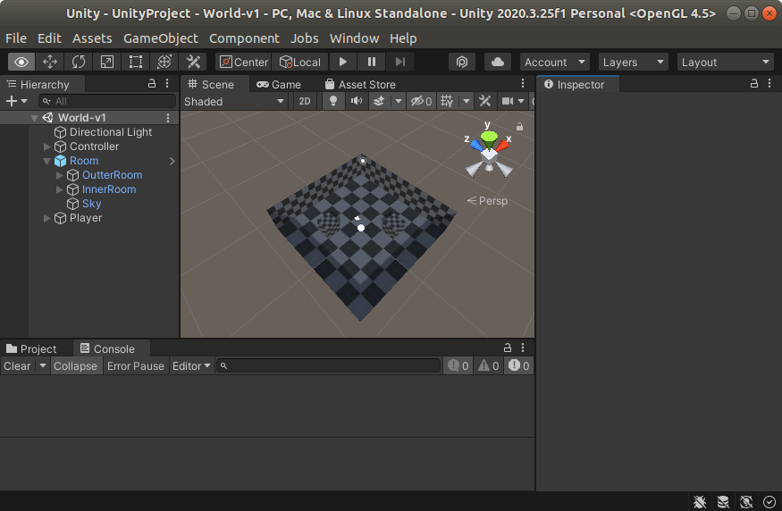

# Quick Start

## Install with pip

The python side of WOB is available as a [PyPi package](https://pypi.org/project/worldofbugs/).

```
pip install worldofbugs
```

Note: as usual it is recommended use a virtual environment to avoid dependency issues.

## Install from source

Clone the GitHub repository and install locally with `pip`:

```
git clone https://github.com/BenedictWilkins/world-of-bugs.git
cd worldofbugs
pip install ./worldofbugs
```

---------------------

From here there are two options: use a standalone build, or use the unity editor. If you want to use the unity editor, skip to the [next section](#getting-started-with-unity).

## Getting Started With Standalone Builds

Download the latest build for your system [here](https://github.com/BenedictWilkins/world-of-bugs/releases).

Extract the build files to a directory of your choice, for example `~/Downloads/builds/World-v1`.

To run with the default build settings:

```python
import worldofbugs

worldofbugs.utils.BuildResolver.search_paths += "~/Downloads/builds/"   # add downloaded/builds to path
print(worldofbugs.utils.BuildResolver.search_paths)                     # list all search paths
print(worldofbugs.utils.BuildResolver.builds)                           # list all avaliable environments

# make the environment
env = worldofbugs.make('WOB/World-v1')

env.reset()
for i in range(1000):                    # advance simulation 1000 steps
    env.step(env.action_space.sample())  # take a random action
    env.render()                         #render the game screen, requires pygame installation
```

??? warning "Debug"
    `BuildResolver` only searches 1 directory deep to looks for build files, if your build doesn't show up, make sure the directory structure looks something like the following:

    ```none
    builds
    └── World-v1
        ├── LinuxPlayer_s.debug
        ├── UnityPlayer_s.debug
        ├── UnityPlayer.so
        ├── World-v1_Data
        └── World-v1.x86_64
    ```
    `builds` being the directory added to `BuildResolver.search_paths` as above. By default, the current working directory and the `build` directory in the `worldofbugs` install directory will also be searched.

If everything worked correctly you should see a build printout like:

```
[<SEARCH PATHS>]
[~/Downloads/builds/World-v1/World-v1.x86_64]
```

If you have `pygame` installed (`pip install pygame`) something like the following should appear in your `pygame` window otherwise comment out `env.render()` to avoid the error.


You may also notice that a small Unity window popped up, unfortunately this is required to ensure the agent's observations are correctly rendered, see [here](https://answers.unity.com/questions/1672109/native-texture-pointer-returns-0-in-headless-build.html) for details.

-----------

## Getting Started with Unity

Rather than using a standalone build, it is also possible to connect directly to the Unity editor. This requires the `worldofbugs` project to be open in Unity. If you haven't already, download `worldofbugs` from GitHub.

```
git clone https://github.com/BenedictWilkins/world-of-bugs.git
```

To avoid issues, install Unity version 2020.3.29f1 which can be found in the [unity download archive](https://unity3d.com/get-unity/download/archive) using the latest version of [UnityHub](https://unity3d.com/get-unity/download).

Open UnityHub (v3.2.0) and choose `Open->Add project from disk` navigate to the `worldofbugs` directory then `com.worldofbugs.worldofbugs/Samples~` and select either the `2D` or `3D` project and `Add Project`.

Open in the unity editor, and you should be presented with an empty scene. Go to `Assets` and select the environment you would like to work with e.g. `World-v1`. Open a scene by going to `World-v1/Scenes` and selecting the scene `World-v1.unity`. Once opened you should be presented with the following:



To look through the eyes of the agent, go to `window->Preview->RenderTextureCameraPreview` this should open a new window that shows


To connect to the editor, run the following script and then press the play button in the editor window.

```python
import worldofbugs
# make the environment, None indicates we want to connect to the editor
env = worldofbugs.make(None)

env.reset()
for i in range(1000):                 # advance simulation 1000 steps
    env.step(env.action_space.sample()) # take a random action, this will happen in the editor
```

??? warning "Debug"
    if it looks like the agent isn't doing anything when running this script, the agent might not be using the correct behaviour. The agent's behaviour can be changed by setting it in unity editor by opening the `Player` game object and changing the `Heuristic` option to `None` in the attached `Agent` component. This can also be done from Python using the following `env.set_agent_behaviour('Python')` before resetting the environment.

You should see the agent (white sphere) start to move around the level in the scene view, or a message like the one below in the game view.


By default, the game view is not rendered as no cameras are in use. To look through the eyes of the agent, in the Unity editor go to `Window -> Preview -> RenderTextureCameraPreview`.


The game view can be safely closed in favour of this new view.

-----------------


To get setup with bugs and agent behaviours see [Live Configuration](./Live%20Configuration/index.md)
